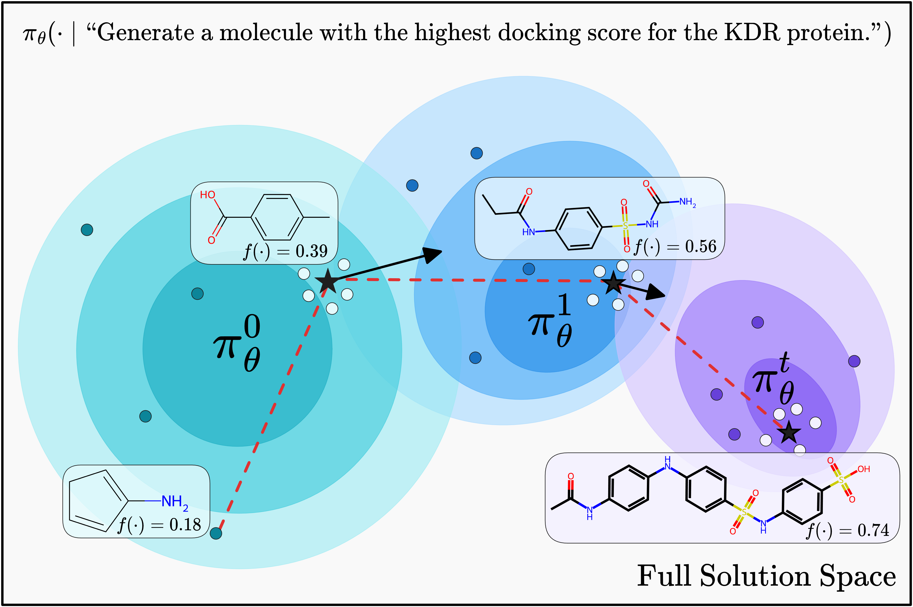

# MiGrATe: Mixed-Policy GRPO for Adaptation at Test-Time
> Paper: https://www.arxiv.org/abs/2508.08641

## Overview
**MiGrATe** is a test-time adaptation framework that iteratively searches for optimal solutions in challenging domains. Given a search problem, MiGrATe iteratively searches for optimal solutions by sampling candidates and updating its policy model $\pi_\theta^t$ using mixed-policy GRPO.
    In each iteration, we combine online samples ($\bullet$) from the current policy distribution,
    % are generated and a 
    top-performing past solutions ($\star$) as greedy references,
    and samples drawn from the neighborhoods of greedy solutions ($\circ$) to form a GRPO group. 
    The resulting group is used to update $\pi_\theta^t$ and *migrate* towards a sampling distribution that is likely to generate higher-quality solutions according to $f(\cdot)$.

## Environment Setup
```bash
conda create -n migrate python=3.10
conda activate migrate  
pip install -r requirements.txt
```

## Running Experiments

### Semantle (Word Search)
**Run Scripts**
```bash
# Baselines
python semantle_inference.py --strat "random_sample"       # Random
python semantle_inference.py --strat "random_top3_ns"      # NS
python semantle_inference.py --strat "opro_10k"            # OPRO
./scripts/semantle/1_grpo.sh                               # GRPO
./scripts/semantle/2_grpo_greedy.sh                        # GRPO-Greedy

# MiGrATe Variants
./scripts/semantle/3_migrate.sh                            # MiGrATe
./scripts/semantle/4_migrate_opro.sh                       # MiGrATe (OPRO)
./scripts/semantle/6_migrate_evo.sh                        # MiGrATe (Evolution)
```


## Dockstring (Molecule Optimization)
- Install [Open Babel](https://openbabel.org/docs/Installation/install.html)

**Run Scripts**
```bash
# Baselines
python dockstring_inference.py --strat "random_sample"     # Random
python dockstring_inference.py --strat "random_top3_ns"    # NS
python dockstring_inference.py --strat "opro_5k"           # OPRO
./scripts/dockstring/1_grpo.sh                             # GRPO
./scripts/dockstring/2_grpo_greedy.sh                      # GRPO-Greedy

# MiGrATe variants
./scripts/dockstring/3_migrate.sh                          # MiGrATe
./scripts/dockstring/4_migrate_opro.sh                     # MiGrATe (OPRO)
```

## ARC (Abstraction and Reasoning Corpus)
- Dataset Setup:  
    - Ensure the following are installed:
      - Kaggle API (`kaggle` package)
    - Set up Kaggle API credentials (if not already done):
      - Go to [Kaggle](https://www.kaggle.com/).
      - Navigate to **Account Settings**.
      - Scroll down to the **API** section and click "Create New API Token".
      - This downloads a `kaggle.json` file.
      - Move this file to `~/.kaggle/`.
      - Set appropriate permissions:
        ```bash
        chmod 600 ~/.kaggle/kaggle.json
        ```
    - Download the dataset:
       ```bash
       kaggle competitions download -c arc-prize-2024 -p ./kaggle/input/arc-prize-2024
       unzip ./kaggle/input/arc-prize-2024/arc-prize-2024.zip -d ./kaggle/input/arc-prize-2024/
       ```
       
### ARC-Small/Full scripts

**Run Scripts**
```bash
# ARC-Small baselines
./scripts/arc_small/0_random.sh           # Random
./scripts/arc_small/1_ns.sh               # NS
./scripts/arc_small/2_opro.sh             # OPRO
./scripts/arc_small/3_grpo.sh             # GRPO
./scripts/arc_small/4_grpo_greedy.sh      # GRPO-Greedy
# ARC-Small MiGrATe variants
./scripts/arc_small/5_migrate.sh          # MiGrATe
./scripts/arc_small/6_migrate_opro.sh     # MiGrATe (OPRO)

# ARC-Full baselines
./scripts/arc_full/0_random.sh            # Random
./scripts/arc_full/1_ns.sh                # NS
./scripts/arc_full/2_opro.sh              # OPRO
./scripts/arc_full/3_grpo.sh              # GRPO
./scripts/arc_full/4_grpo_greedy.sh       # GRPO-Greedy
# ARC-Full MiGrATe variants
./scripts/arc_full/5_migrate.sh           # MiGrATe
./scripts/arc_full/6_migrate_opro.sh      # MiGrATe (OPRO)
```
